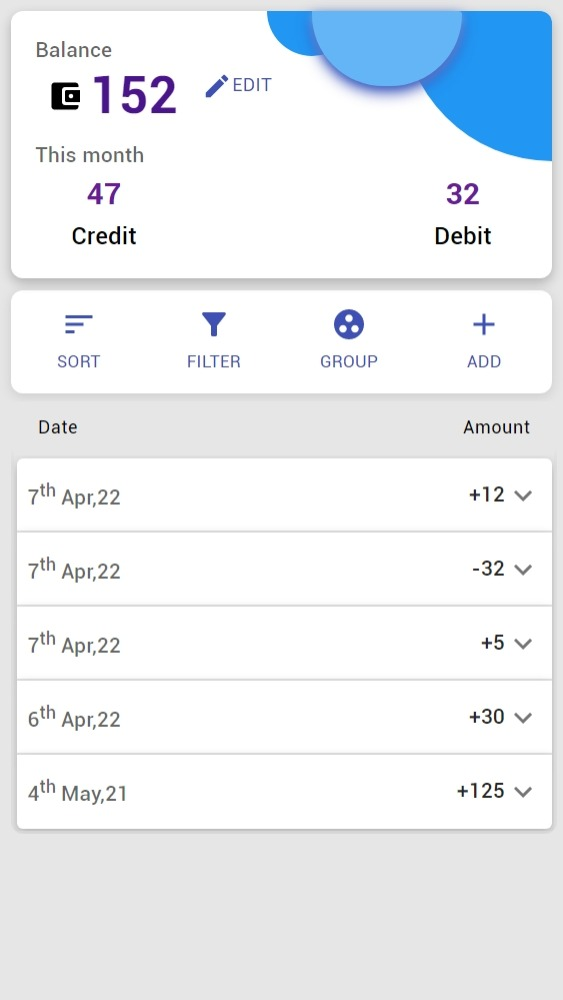
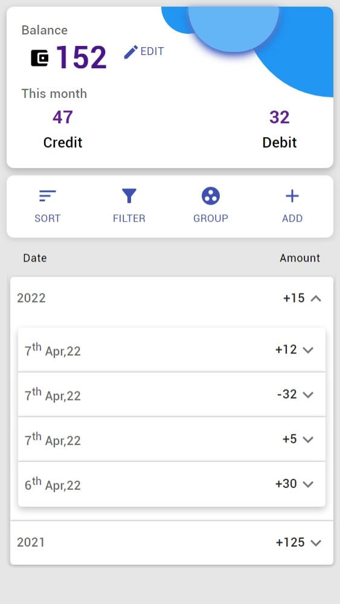
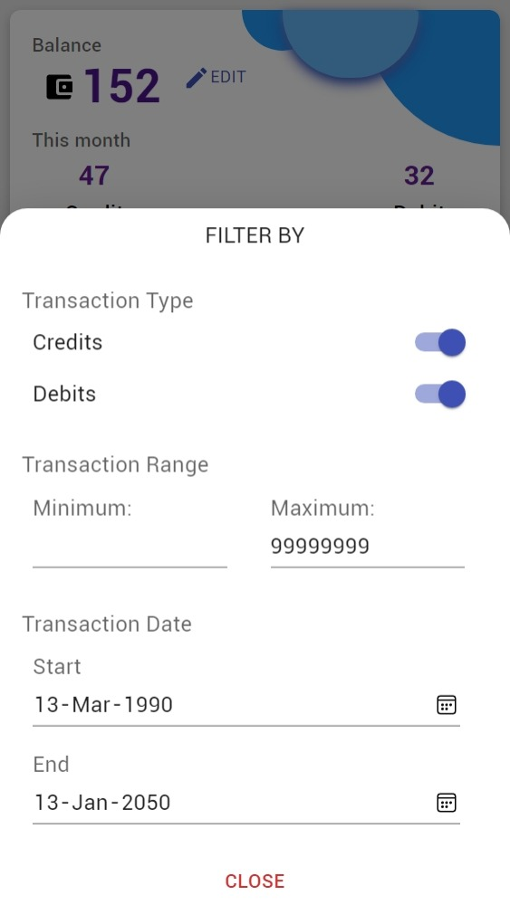

# Expense manager

CRUD application built using React.JS, Redux-toolkit, Redux-persist and React-router with features like Sort, Group, Filter transactions by different parametersfor better insight.

Built with Mobile first approach.

Help me build the most feature rich expense management app.

## Hosted on firebase url https://expenserecoder.web.app

  
<!--   App view -->
<!-- 
 -->
<!-- 
 -->
  
<!--   Group by year -->
<!-- 
 -->
<!-- 
 -->
  
<!--   Filter by menu -->

Todo next

### convert into a multi page app "react-router"
### optimize for desktop view
